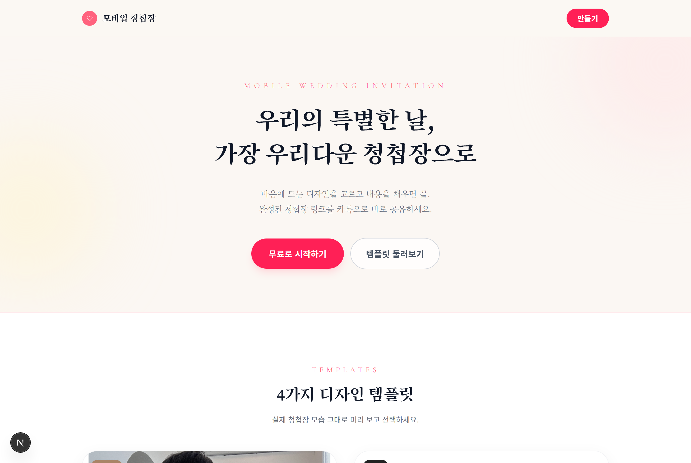
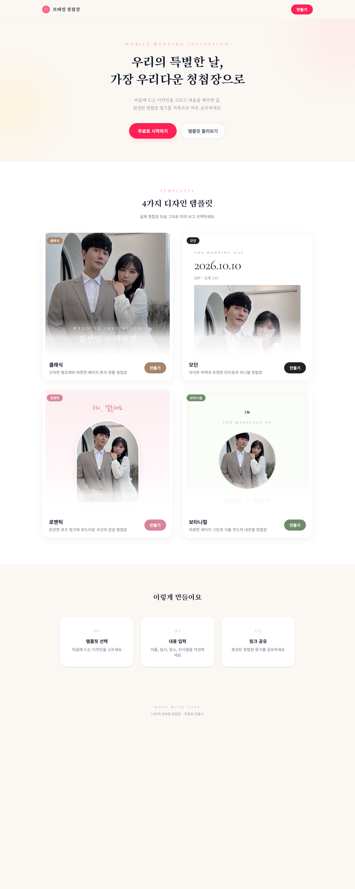

<div align="center">

# ✦ 별빛 초대장

**우리의 별처럼 빛나는 시작, 가장 우리다운 청첩장으로 — 모바일 청첩장 메이커**

템플릿을 고르고, 내용을 입력하면 나만의 모바일 청첩장이 완성됩니다.
완성된 청첩장은 고유 링크로 발급되어 카카오톡으로 바로 공유할 수 있어요.

<sub>결혼·육아·가족을 위한 웹서비스 **별마마파파**의 첫 번째 서비스</sub>

<br/>

[](https://wedding-invite-rose-six.vercel.app)

<br/>


<br/>



</div>

<br/>

## ✨ 주요 기능

- 🎨 **4가지 감성 템플릿** — 클래식 · 모던 · 로맨틱 · 보타니컬
- 🖊️ **실시간 미리보기** — 입력하는 즉시 오른쪽 청첩장에 그대로 반영
- 🔤 **9종 한글 글꼴** — 명조 · 고딕 · 손글씨까지 제목/본문 따로 선택
- 📷 **사진 업로드** — 대표 사진 + 갤러리(최대 7장), 자동 압축 후 클라우드 저장
- 📍 **카카오맵 길찾기** — 예식장 주소로 바로 길찾기 버튼
- 💳 **마음 전하실 곳** — 신랑/신부측 계좌 안내
- 🔗 **공유 링크 발급** — `/v/abc12345` 형태의 짧은 링크 + 카톡 공유용 OG 미리보기
- 📱 **모바일 최적화** — 하객은 별도 앱 설치 없이 링크만 열면 끝

<br/>

## 🎨 템플릿

| | 템플릿 | 분위기 |
|---|---|---|
| 🤎 | **클래식** | 단아한 명조체와 따뜻한 베이지 톤의 정통 청첩장 |
| 🖤 | **모던** | 넉넉한 여백과 또렷한 타이포의 미니멀 청첩장 |
| 💗 | **로맨틱** | 은은한 로즈 핑크와 부드러운 곡선의 감성 청첩장 |
| 💚 | **보타니컬** | 차분한 세이지 그린과 식물 무드의 내추럴 청첩장 |

<br/>

## 📸 미리보기

<div align="center">

</div>

> 🌐 **직접 만들어 보기 →** [wedding-invite-rose-six.vercel.app](https://wedding-invite-rose-six.vercel.app)

<br/>

## 🛠 기술 스택

- **프레임워크** — Next.js 16 (App Router · Turbopack), React 19, TypeScript
- **스타일** — Tailwind CSS, next/font (한글 웹폰트)
- **백엔드 / 저장소** — Supabase (PostgreSQL + Storage)
- **배포** — Vercel
- **이미지** — 클라이언트 사이드 압축(Canvas) 후 Storage 업로드, 데이터엔 URL만 저장

<br/>

## 🚀 빠른 시작 (로컬)

```bash
npm install
npm run dev
```

→ http://localhost:3000 접속 후 **"무료로 시작하기"**

> 💡 Supabase 설정이 없어도 동작합니다. 이 경우 청첩장은 `.data/invitations.json`,
> 사진은 `public/uploads/` 에 저장돼요 (개발/테스트용 로컬 폴백).

<br/>

## ☁️ 배포 (Supabase + Vercel)

<details>
<summary><b>1. Supabase 프로젝트 연결</b></summary>

1. [supabase.com](https://supabase.com) 에서 프로젝트 생성
2. `supabase/schema.sql` 내용을 **SQL Editor** 에 붙여넣고 실행
   → `invitations` 테이블 + 공개 Storage 버킷 `photos` + 정책이 한 번에 생성됩니다
3. `.env.local.example` → `.env.local` 로 복사하고 값 채우기
   - `NEXT_PUBLIC_SUPABASE_URL`, `NEXT_PUBLIC_SUPABASE_ANON_KEY` (Settings → API)
   - (선택) `SUPABASE_SERVICE_ROLE_KEY`
4. `npm run dev` 재시작

</details>

<details>
<summary><b>2. Vercel 배포</b></summary>

1. GitHub 레포 import
2. **Environment Variables** 에 `NEXT_PUBLIC_SUPABASE_URL`, `NEXT_PUBLIC_SUPABASE_ANON_KEY` 등록
3. **Deploy** → `https://your-app.vercel.app` 발급
4. 이후 `git push` 하면 **자동 재배포**

</details>

<br/>

## 📁 프로젝트 구조

```
src/
  app/
    page.tsx                   랜딩 (템플릿 소개)
    editor/page.tsx            편집 화면
    v/[slug]/page.tsx          발행된 청첩장 (공유 링크)
    api/
      invitations/route.ts     청첩장 저장 API (POST)
      upload/route.ts          사진 업로드 API (POST)
  components/
    EditorClient.tsx           폼 + 실시간 미리보기
    InvitationView.tsx         청첩장 렌더링 (편집/발행 공용)
    GalleryAlbum.tsx           갤러리 + 확대 보기
  lib/
    types.ts                   데이터 모델 · 정규화
    templates.ts               템플릿 · 글꼴 메타데이터
    store.ts                   청첩장 저장소 (Supabase ↔ 로컬 폴백)
    storage.ts                 사진 저장소 (Supabase Storage ↔ 로컬 폴백)
    image.ts                   클라이언트 이미지 압축
supabase/
  schema.sql                   테이블 · 버킷 · RLS 정책
```

<br/>

## 🗺 다음 단계 아이디어

- [ ] 방명록 / 참석 여부(RSVP)
- [ ] 배경 음악, 디데이 카운트다운
- [ ] 내 청첩장 관리 (로그인 + 수정/삭제)
- [ ] 커스텀 도메인 연결
- [ ] 템플릿 추가

<br/>

<div align="center">
<sub>Made with 💕 for the special day</sub>
</div>
