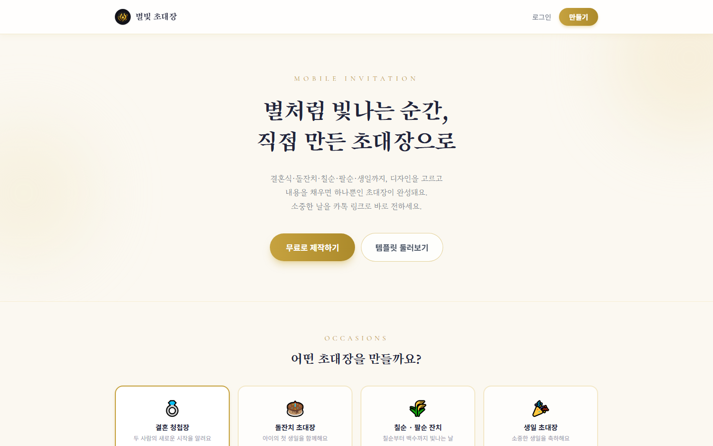
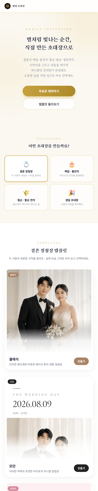

<div align="center">

# ✦ 별빛 초대장

**별처럼 빛나는 순간, 직접 만든 초대장으로 — 모바일 초대장 메이커**

결혼식 · 돌잔치 · 칠순 잔치 · 생일까지,
템플릿을 고르고 내용을 입력하면 나만의 모바일 초대장이 완성됩니다.
완성된 초대장은 고유 링크로 발급되어 카카오톡으로 바로 공유할 수 있어요.

<sub>결혼·육아·가족을 위한 웹서비스 **별마마파파**의 첫 번째 서비스</sub>

<br/>

[](https://starinvite.vercel.app)

<br/>


<br/>



</div>

<br/>

## ✨ 주요 기능

- 🗂 **4가지 초대장 종류** — 결혼 청첩장 · 돌잔치 · 칠순/팔순 잔치 · 생일
- 🎨 **종류별 전용 템플릿 24종** — 종류마다 6개씩, 디자인이 서로 완전히 다름
- 🖊️ **실시간 미리보기** — 입력하는 즉시 오른쪽 초대장에 그대로 반영
- 🎬 **대표 사진 모션 4종** — 줌 인 · 줌 아웃 · 아웃포커스 · 흑백→컬러
- 🔤 **9종 한글 글꼴** — 명조 · 고딕 · 붓글씨까지 제목/본문 따로 선택
- 📷 **사진 업로드** — 대표 사진 + 갤러리(최대 20장), 자동 압축 후 클라우드 저장
- 📍 **네이버지도 · 카카오맵** — 장소 주소를 원하는 지도 앱으로 바로 열기 + 주소 복사
- 💳 **마음 전하실 곳** — 계좌 안내 (결혼은 신랑/신부측 구분)
- ⏱️ **디데이 카운트다운** — 남은 일/시/분/초 실시간 표시
- 🔗 **공유 링크 발급** — `/v/abc12345` 짧은 링크 + 카톡 공유 카드(OG 미리보기)
- 🔐 **카카오 · 네이버 로그인** — 만든 초대장을 언제든 수정·삭제
- 🧹 **자동 정리** — 행사 다음 날 링크와 사진까지 완전 삭제
- 📱 **모바일 최적화** — 하객은 앱 설치 없이 링크만 열면 끝

<br/>

## 🗂 초대장 종류

메인에서 종류를 고르면 그에 맞는 전용 템플릿과 입력 폼이 나타납니다.

| | 종류 | 입력 형태 | 특징 |
|---|---|---|---|
| 💍 | **결혼 청첩장** | 신랑 · 신부 2인 | 혼주 4명, 신랑/신부측 계좌 구분 |
| 🎂 | **돌잔치 초대장** | 아기 1인 | 사진과 이름만 담백하게 |
| 🌾 | **칠순 · 팔순 잔치** | 주인공 1인 | 칠순/팔순/구순/백수 선택 → 문구 자동 변경 |
| 🎉 | **생일 초대장** | 주인공 1인 | 파티 무드 중심 |

<br/>

## 🎨 템플릿 (24종)

<details open>
<summary><b>💍 결혼 청첩장</b></summary>

| | 템플릿 | 분위기 |
|---|---|---|
| 🤎 | **클래식** | 단아한 명조체와 따뜻한 베이지 톤의 정통 청첩장 |
| 🖤 | **모던** | 넉넉한 여백과 또렷한 타이포의 미니멀 청첩장 |
| 💗 | **로맨틱** | 은은한 로즈 핑크와 부드러운 곡선, 흩날리는 꽃잎 |
| 💚 | **보타니컬** | 차분한 세이지 그린과 식물 무드의 내추럴 청첩장 |
| ✨ | **별빛** | 반짝이는 별과 금빛이 쏟아지는 밤하늘 무드 |
| 🎞 | **필름** | 여백과 타이포가 살아있는 필름 화보 무드 |

</details>

<details>
<summary><b>🎂 돌잔치</b></summary>

| | 템플릿 | 분위기 |
|---|---|---|
| 🧸 | **곰돌이** | 포근한 베이지 톤에 풍선과 곰인형이 함께 |
| ☁️ | **구름 위 아기** | 파스텔 하늘 위 무지개와 흐르는 구름 |
| 🎏 | **색동** | 색동 저고리처럼 고운 전통 무드 |
| ⭐ | **아기별** | 밤하늘에 찾아온 작은 별, 금빛 반짝임 |
| 🌿 | **꼬마정원** | 새싹과 들꽃이 돋아나는 연둣빛 내추럴 |
| 🖍 | **크레용** | 손그림 스케치북처럼 알록달록 장난스럽게 |

</details>

<details>
<summary><b>🌾 칠순 · 팔순 잔치</b></summary>

| | 템플릿 | 분위기 |
|---|---|---|
| 🍷 | **수연** | 자주빛과 금빛이 어우러진 격조 있는 수연례 |
| 🌸 | **모란** | 탐스러운 모란처럼 따뜻하고 화사하게 |
| 🌲 | **송학** | 소나무와 학처럼 푸르고 장수를 기원하는 |
| ✨ | **별빛 수연** | 별이 쏟아지는 밤하늘에 금빛으로 새긴 |
| 🖌 | **한지** | 한지의 결과 수묵의 여백, 붉은 낙관 |
| 📔 | **가족앨범** | 빛바랜 가족사진첩을 넘기는 듯한 |

</details>

<details>
<summary><b>🎉 생일</b></summary>

| | 템플릿 | 분위기 |
|---|---|---|
| 🎊 | **파티팝** | 알록달록 컨페티가 쏟아지는 신나는 파티 |
| 🌃 | **네온 나이트** | 네온사인이 반짝이는 다크 파티 무드 |
| ⬜ | **미니멀 데이** | 큼직한 타이포와 여백이 시원한 |
| ⭐ | **별빛 생일** | 밤하늘에 소원을 비는 별빛 가득 |
| 🎂 | **케이크** | 촛불을 끄는 순간처럼 달콤한 파스텔 |
| 💐 | **플라워** | 꽃다발을 건네듯 화사한 플로럴 |

</details>

<br/>

## 📸 미리보기

<div align="center">

</div>

> 🌐 **직접 만들어 보기 →** [starinvite.vercel.app](https://starinvite.vercel.app)

<br/>

## 🔐 계정 · 데이터 수명

이 서비스는 **개인 사진과 가족 정보를 다루기 때문에** 보관 기간을 짧게 잡았습니다.

| 항목 | 정책 |
|---|---|
| 로그인 | 카카오 · 네이버 (Supabase Auth) |
| 세션 | 브라우저를 닫거나 **24시간**이 지나면 자동 로그아웃 |
| 제작 한도 | **종류마다 1개씩, 계정당 최대 4개** |
| 게시 기간 | 행사 **당일까지** 공개 (직접 고르지 않고 행사 날짜로 자동 결정) |
| 자동 삭제 | 행사 **다음 날 0시(KST)** 에 DB 행과 업로드 사진까지 완전 삭제 |

- 만료된 초대장은 종류 한도에서 빠지므로, 삭제를 기다리지 않고 같은 종류를 새로 만들 수 있어요.
- 초대장을 직접 삭제하거나 사진을 교체하면, 쓰이지 않게 된 사진도 Storage에서 함께 정리됩니다.
- 정리 작업은 매일 00:30(KST)에 도는 Vercel Cron(`/api/cron/purge`)이 수행합니다.

> ⚠️ 삭제는 **복구할 수 없습니다.** 사용자에게도 에디터와 마이페이지에서 안내하고 있어요.

<br/>

## 🛠 기술 스택

- **프레임워크** — Next.js 16 (App Router · Turbopack), React 19, TypeScript
- **스타일** — Tailwind CSS v4, next/font (한글 웹폰트), CSS 애니메이션
- **인증** — Supabase Auth (카카오 OAuth) + 네이버 커스텀 OAuth 플로우
- **백엔드 / 저장소** — Supabase (PostgreSQL + Storage)
- **정기 작업** — Vercel Cron → 만료 초대장 정리
- **배포** — Vercel
- **이미지** — 클라이언트 사이드 압축(Canvas) 후 Storage 업로드, 데이터엔 URL만 저장

> 💡 Next.js 16부터 `middleware.ts`가 **`proxy.ts`** 로 이름이 바뀌었습니다.
> 세션 만료 처리는 [`src/proxy.ts`](src/proxy.ts) 에 있어요.

<br/>

## 🚀 빠른 시작 (로컬)

```bash
npm install
npm run dev
```

→ http://localhost:3000 접속 후 **"무료로 제작하기"**

> 💡 Supabase 설정이 없어도 동작합니다. 이 경우 초대장은 `.data/invitations.json`,
> 사진은 `public/uploads/` 에 저장돼요 (개발/테스트용 로컬 폴백, 로그인은 비활성).

<br/>

## ☁️ 배포 (Supabase + Vercel)

<details>
<summary><b>1. Supabase 프로젝트 연결</b></summary>

1. [supabase.com](https://supabase.com) 에서 프로젝트 생성
2. `supabase/schema.sql` 내용을 **SQL Editor** 에 붙여넣고 실행
   → `invitations` 테이블 + 공개 Storage 버킷 `photos` + 정책이 한 번에 생성됩니다
3. `.env.local.example` → `.env.local` 로 복사하고 값 채우기
   - `NEXT_PUBLIC_SUPABASE_URL`, `NEXT_PUBLIC_SUPABASE_ANON_KEY` (Settings → API)
   - `SUPABASE_SERVICE_ROLE_KEY` — 네이버 로그인과 사진 삭제에 필요 (RLS 우회)
4. `npm run dev` 재시작

</details>

<details>
<summary><b>2. 소셜 로그인 설정</b></summary>

**카카오** — Supabase 대시보드 → Authentication → Providers → Kakao
[developers.kakao.com](https://developers.kakao.com) 에서 앱 생성 후 REST API 키/Secret 입력

**네이버** — Supabase가 기본 제공하지 않아 커스텀 플로우로 처리합니다
[developers.naver.com](https://developers.naver.com) 에서 앱 등록 후 `NAVER_CLIENT_ID`, `NAVER_CLIENT_SECRET` 설정
Callback URL: `{사이트주소}/api/auth/naver/callback`

**카카오톡 공유** — 앱의 JavaScript 키를 `NEXT_PUBLIC_KAKAO_JS_KEY` 에 설정
[앱] → [제품 링크 관리] → [웹 도메인] 에 사이트 주소 등록 필요

</details>

<details>
<summary><b>3. Vercel 배포</b></summary>

1. GitHub 레포 import
2. **Settings → Environment Variables** 에 `.env.local` 의 값들을 등록
3. **`CRON_SECRET` 을 반드시 추가** — 만료 초대장 정리 작업의 인증 토큰
   ```bash
   node -e "console.log(require('crypto').randomBytes(32).toString('base64url'))"
   ```
   미설정 시 `/api/cron/purge` 는 503으로 거부되어 정리가 실행되지 않습니다
4. **Deploy** → `https://your-app.vercel.app` 발급
5. **Cron Jobs** 탭에서 `/api/cron/purge` 가 매일 등록됐는지 확인
6. 이후 `git push` 하면 **자동 재배포**

> 환경변수는 저장만으로 적용되지 않고 **재배포해야** 반영됩니다.

</details>

<br/>

## 📁 프로젝트 구조

```
src/
  proxy.ts                       세션 만료 처리 (Next 16의 미들웨어)
  app/
    page.tsx                     랜딩 (종류 선택 + 템플릿 미리보기)
    editor/page.tsx              편집 화면 (로그인 필수 · 종류당 1개 검사)
    my/page.tsx                  마이페이지 (내 초대장 관리)
    login/page.tsx               카카오 · 네이버 로그인
    v/[slug]/page.tsx            발행된 초대장 (공유 링크)
    api/
      invitations/route.ts       초대장 저장 (POST)
      invitations/[slug]/route.ts  수정 · 삭제 (PATCH · DELETE)
      upload/route.ts            사진 업로드 (POST)
      cron/purge/route.ts        만료 초대장 완전 삭제 (Vercel Cron)
      auth/naver/*               네이버 커스텀 OAuth
    auth/callback/route.ts       카카오 OAuth 콜백
  components/
    EditorClient.tsx             폼 + 실시간 미리보기
    InvitationView.tsx           초대장 렌더링 24종 (편집/발행 공용)
    MyPageClient.tsx             내 초대장 목록 · 삭제
    GalleryAlbum.tsx             갤러리 + 확대 보기
    MapSection.tsx               지도 + 네이버지도 · 카카오맵 열기
    Countdown.tsx                디데이 카운트다운
    KakaoShareButton.tsx         카카오톡 공유 카드
  lib/
    types.ts                     데이터 모델 · 정규화 · 만료일 계산
    categories.ts                종류별 문구 · 필드 구성
    templates.ts                 템플릿 24종 · 글꼴 메타데이터
    store.ts                     초대장 저장소 (Supabase ↔ 로컬 폴백)
    storage.ts                   사진 저장소 · 삭제 (Supabase Storage ↔ 로컬)
    session.ts                   세션 수명 정책
    image.ts                     클라이언트 이미지 압축
supabase/
  schema.sql                     테이블 · 버킷 · RLS 정책
vercel.json                      Cron 스케줄 (매일 00:30 KST)
```

<br/>

<div align="center">
<sub>Made with 💕 for the special day</sub>
</div>
